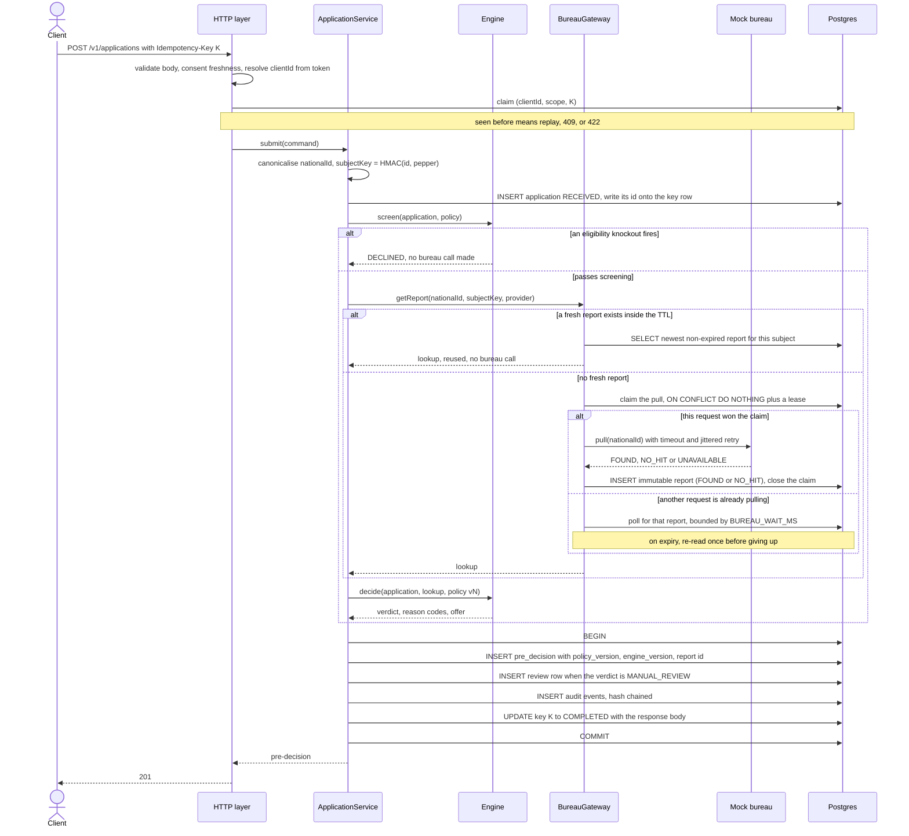
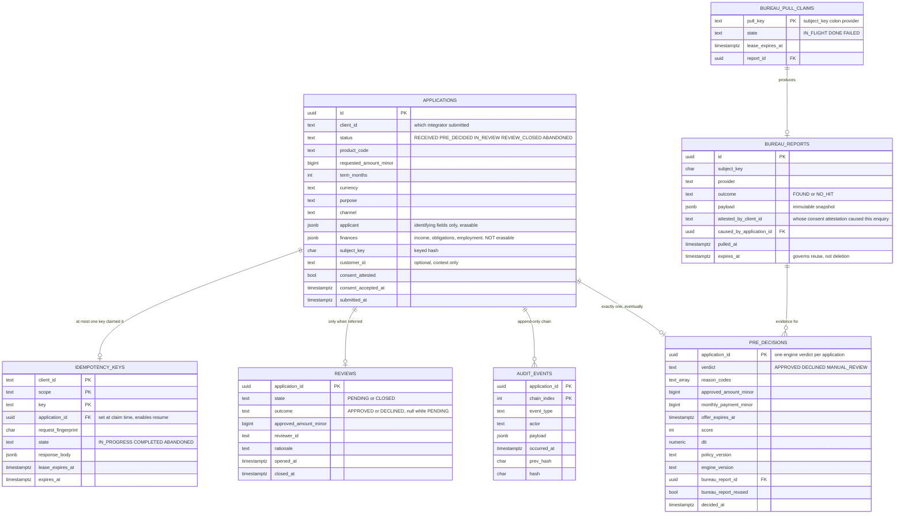
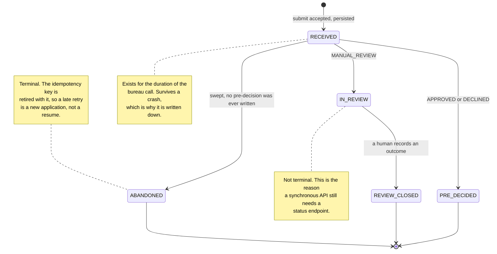

# 01 — Architecture

One Node process and one Postgres database. Everything below explains why that
is enough, and where the correctness actually lives.

A note on vocabulary, used consistently from here on: this service produces a
**pre-decision** — an automated assessment of declared data plus a bureau
report. It is not the final credit decision. When an application is referred, a
human at the lender makes the final decision using criteria this service does
not model, and that outcome is a **separate entity** with its own actor. See
ADR-0006.

---

## 1. Layers

Four bands. A layer may call downward only — never upward, and never sideways.
The Application layer calls both bands beneath it, which is what an orchestrator
does: it assembles infrastructure results and hands them to a domain that can
reach nothing on its own.

| Layer | Holds | May call |
|---|---|---|
| **HTTP** | Routes, request schemas, auth, error mapping | Application |
| **Application** | `ApplicationService`, idempotency, audit recording | Domain, Infrastructure |
| **Domain** | `screen`, `decide`, policy, reason codes | **nothing** |
| **Infrastructure** | Repositories, `BureauGateway`, resilience, clock | Postgres, mock bureau |

The rule that carries the most weight is the third row. The engine receives an
application, a bureau lookup and a policy, and returns a pre-decision. It does
not read the clock, open a connection or make a call.

Three consequences follow directly, and each is worth more than the rule itself:

- The rules are testable as a table of inputs and expected outputs, with no
  database in the loop.
- A pre-decision can be **replayed** years later from stored inputs — which is
  what makes `POST /v1/audit/pre-decisions/{id}/replay` possible at all.
- Nothing in the rules can accidentally depend on wall-clock time or on the
  order two requests happened to arrive in.

### The engine has two entry points, not one

```
screen(application, policy, now)                 -> Knockout | null
decide(application, lookup, policy, now)         -> PreDecision
```

`screen` runs the eligibility knockouts that need **no bureau data at all**:
age, product limits, term limits, declared income floor. It runs *before* the
bureau is called.

This split is not tidiness. An applicant who is under 18, or asking for twice
the product ceiling, is going to be declined either way — and pulling their file
first would leave a hard enquiry on the credit record of a person whose
application was never going to succeed. A single `evaluate(...)` after the pull
cannot express that, which is why the signature is two functions rather than one
with a flag.

---

## 2. The request path



Five things in that order are deliberate:

**Validation happens before anything is claimed.** A malformed body, or a
consent attestation older than the policy window, burns no idempotency key,
creates no row and touches no bureau.

**The application is persisted before the bureau is called, and its id is
written onto the idempotency key row in the same statement.** An application is
a business event: if the bureau then fails, the record still exists. The second
half is what makes a crash recoverable — see §4.

**Screening runs before the pull.** The cheapest guard is also the one with an
ethical consequence, and it is the only ordering that keeps the claim in
`docs/03-decision-policy.md` §2 true.

**The reuse check comes before the claim.** The common case — the same person
applying again after a decline — costs one indexed lookup and no lock.

**The closing writes are one transaction** — the pre-decision, the review row,
the *closing* audit events and the key completion. Split them and there are two
silent failure windows: a decision with no trail, or a client replaying a
response for a decision that was rolled back.

**But the chain is written across three transactions, not one.** This is
deliberate and the diagram above shows it: `APPLICATION_RECEIVED` is appended
with the application insert, `BUREAU_PULL_REQUESTED` is appended **before** the
network call, and the rest are appended at the end. Deferring them all to the
closing transaction would mean that a process dying mid-pull leaves no record
that this person's credit file was marked — the one harm the whole of
`docs/02-idempotency.md` exists to prevent, erased by the crash that caused it.

The chain tolerates this because it is per-application and ordered by
`(application_id, chain_index)`: each transaction appends at the next index, and
a concurrent double-append violates the primary key rather than forking. What is
atomic is the *decision and its closing trail*, not the chain as a whole.

---

## 3. Data model



### Two columns that are easy to leave out

**`finances` is a separate column from `applicant`, and it is not erasable.**
`docs/04-audit.md` §5 argues that a future pseudonymisation job can clear the
identifying fields without destroying auditability. That argument only holds if
the fields the engine *reads* live outside the erasable blob:
`monthlyIncomeMinor` is the denominator of DTI and the threshold at S1, so a
pre-decision cannot be replayed without it. An earlier version of this diagram
had no home for the finances at all, which quietly made replay impossible for
every affordability outcome while the documents claimed otherwise.

**`bureau_reports.attested_by_client_id` records whose consent attestation caused
the enquiry.** Reuse deliberately crosses client boundaries — the aggregator case
in ADR-0002 is the reason layer 3 exists — so the client deciding on a report is
frequently not the client whose attestation caused it. Without this column, the
audit question "who told us this person authorised an enquiry" is answered with
the wrong client's name on every reused report, which is the common case by
design. See ADR-0002's consequences for the exposure this makes visible rather
than removes.

### Where the guarantees physically live

**Four constraints, one compare-and-set, and one lease.** They are not the same
strength, and the difference is stated rather than blurred, because the weakest
of the three is the one guarding the requirement the brief singled out.

**Four constraints — the database refuses the bad state outright:**

| Constraint | Prevents |
|---|---|
| `idempotency_keys` PK `(client_id, scope, key)` | Two requests with the same key both proceeding — **and** one integrator's key colliding with another's, which would hand them a stranger's stored response |
| `pre_decisions` PK `(application_id)` | A second, conflicting engine verdict on one application |
| `audit_events` PK `(application_id, chain_index)` | A concurrent double-append breaking the chain |
| `reviews` CHECK: `state='CLOSED'` implies `outcome` and `reviewer_id` are not null | A closed review with no outcome, or with **no attributable human** — which is precisely the audit question "could anyone have altered a verdict after the fact?" |

**One compare-and-set.** Closing a review is a conditional update,
`... WHERE state = 'PENDING'`, so two concurrent close attempts result in one
write and one `409`. Postgres evaluates the predicate under the row lock, so this
is as strong as a constraint for the property it guards.

**One lease, and it is weaker than both.** `bureau_pull_claims` PK `(pull_key)`
stops two callers holding the claim *simultaneously*. It does not stop two pulls.
The takeover predicate — `WHERE state='FAILED' OR lease_expires_at < $now` —
deliberately admits a second caller once `BUREAU_CLAIM_LEASE_MS` has elapsed, the
winner does not verify it still holds the lease before writing, and
`bureau_reports` carries no uniqueness on `(subject_key, provider)`. A holder that
is merely **slow** rather than dead — a GC pause, a stalled managed-Postgres
write, a container the platform paused — produces two hard enquiries and the
database does not object.

Three things follow, and they are stated together because the first without the
other two is a shrug:

- **What would make it a proof.** The winner's report write becomes conditional
  on still holding the lease (`... WHERE pull_key = $1 AND state = 'IN_FLIGHT'
  AND lease_expires_at > now()`), and a lost lease is treated as "someone else
  owns this now". That is fencing, and it is roughly ten lines.
- **Why not in v1.** It buys correctness in an interleaving that requires a
  holder to be alive but stalled for longer than the lease, and it costs a
  branch on the path that every application takes. The lease is set at 5 s
  against a winner's worst case of ~1.8 s, so the window is real but narrow.
- **The residual harm, named.** One extra hard enquiry on the applicant's file
  in that interleaving. Not a wrong decision, not a lost record, and not on the
  common path — but it is precisely the harm `docs/02-idempotency.md` §1 says
  this design exists to prevent, so it is a debt and not a non-issue. The
  trigger for paying it: the first time `bureau_claim_contention_total` shows
  contention at a rate where a rare interleaving stops being rare.

One index, which guarantees nothing and only makes the reuse lookup cheap:
`bureau_reports (subject_key, provider, pulled_at DESC)`. It is ordered on
`pulled_at` because that is what the reuse query orders on; indexing
`expires_at` instead is equivalent only while the TTL is one global constant,
and `docs/02-idempotency.md` §8 names a per-product TTL as a plausible next step
that would silently break it.

"The logic checks it" is a race. "The database will not allow it" is a proof.
Four of the six mechanisms above are proofs; the lease is not, and calling it one
would have been the easiest sentence in this document to write and the least
defensible.

### Two tables that look alike and are not

`bureau_reports` is **immutable evidence**. A row is written once and never
changes. `expires_at` governs whether it may still back a *new* pre-decision; it
has nothing to do with deletion. Deleting an expired report would break every
replay of every decision that used it.

`bureau_pull_claims` is **mutable coordination**. It is a lock with a lease, it
changes constantly, and it carries no history worth keeping.

Keeping them apart is what allows reuse without losing the audit. Folding them
into one table — the obvious first instinct — means a new pull overwrites the
snapshot an old decision depends on.

### Two more that look alike and are not

`pre_decisions` is what **the engine** concluded, from data this service holds.
It is written once and never updated.

`reviews` is what **a human** concluded, using criteria this service does not
model — internal watchlists, documents, a phone call. It is a different fact
produced by a different actor, so it is a different row rather than an edit.

The consequence is the one that matters for auditability: replay compares the
recomputed verdict against `pre_decisions.verdict`, never against the human
outcome. A legitimate override therefore does not masquerade as evidence
tampering. That failure was live in the previous version of this design and is
recorded in ADR-0006.

The final answer a caller sees is composed on read — `review.outcome` when the
review is closed, otherwise `pre_decision.verdict`. Because that composition can
drift if it is written more than once, it exists in exactly one function and
`docs/05-api.md` §4 names it.

---

## 4. Application lifecycle



`PRE_DECIDED` and `REVIEW_CLOSED` are terminal. A pre-decision is never edited;
a human outcome is a new row, not an overwrite.

### The crash window, and how it closes

A process that dies between the application insert and the transaction at the
end leaves a row in `RECEIVED`, no pre-decision, and an idempotency key stuck in
`IN_PROGRESS`. Two mechanisms resolve it, and the first one is the one the
earlier design was missing:

**The key row carries `application_id`, written at claim time.** When the lease
expires and another request takes the key over, it **resumes that application**
rather than inserting a second one. Without this column, takeover silently
created a second application for the same key and falsified the property "the
same key twice produces one application".

**A sweeper moves stale `RECEIVED` rows to `ABANDONED`** after
`ORPHAN_SWEEP_AFTER_MINUTES`, emitting an audit event. Nothing else would ever
resolve an application whose caller never retried; it would sit in a
non-terminal state forever, counted in no funnel and visible to no one.

**The sweeper retires the idempotency key in the same transaction.** Without
that, the two mechanisms disagree: the key is retained for
`IDEMPOTENCY_RETENTION_HOURS` (24) and the sweep runs after
`ORPHAN_SWEEP_AFTER_MINUTES` (15), leaving a window of nearly a day in which a
retry with the original key is told to "resume" an application that is already
terminal. There is no legal answer to that — resurrecting a terminal row breaks
the state machine, and creating a second application falsifies the very property
`application_id` was added to protect. So the sweep marks the key `ABANDONED`
too, and a retry against it is treated as a fresh submission: a new application,
a new key row, and the reuse check in layer 3 means the applicant still gets no
second bureau pull.

The sweeper claims each row with a conditional update before acting, so two
instances sweeping concurrently produce one winner and one no-op rather than two
appends at the same `chain_index`.

---

## 5. Why one process and one database

The correctness of this service rests on unique constraints, and a unique
constraint has to live in the same store as the transaction that changes state.
Moving the queue, the claim table or the audit into a second system turns every
one of those guarantees into a distributed transaction — which is precisely the
problem the single-store design exists to avoid.

Postgres is doing four jobs here: state, uniqueness, the audit chain, and the
coordination lease. All four are things it is good at, and none of them justify
a broker at this volume.

**When that stops being true**, with the trigger rather than the wish:

| Trigger | Change |
|---|---|
| The synchronous bureau call stops fitting the latency budget | Move the pull to a worker; `POST` returns `202`, the status endpoint already exists |
| Ingest outgrows one database | Partition by `subject_key`; the design assumes nothing process-local |
| The bureau needs to be called from more than one flow | Promote `BureauGateway` to its own service; the interface is already the boundary |
| Policy changes need approval outside engineering | Move policy from git to a table with a workflow; the loader is already an interface |
| The review queue becomes a product | `reviews` grows assignment, SLA and a UI — or moves out entirely, leaving this service to record outcomes it is told about |

---

## 6. Configuration and secrets

Every environment variable is validated at boot by a schema, and the process
refuses to start on a bad value. Reading `process.env` where it is needed turns
a typo into a runtime failure under load, usually on the least convenient path.

`SUBJECT_KEY_PEPPER` has **no default**. A defaulted pepper would be a shared
secret baked into the image, and every deployment would derive the same subject
keys from the same identifiers.

`API_TOKENS`, `REVIEWER_TOKENS` and `AUDITOR_TOKENS` also have no defaults, and
the schema refuses to start when `NODE_ENV=production` and **any** of them is
empty. `REVIEWER_TOKENS` is in that list for a reason that is easy to miss: an
empty reviewer list boots cleanly and turns ADR-0006's "the party that submits
cannot also approve" into "nobody can approve", with every referred application
stuck in `IN_REVIEW` and no error anywhere. Auth that is documented
as mandatory and defaults to off is worse than no auth, because it reads as
protected.

The full list, with the reasoning attached to the values that carry risk, is in
`.env.example`.
